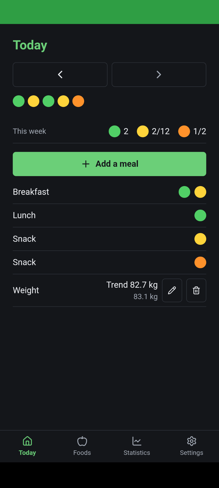
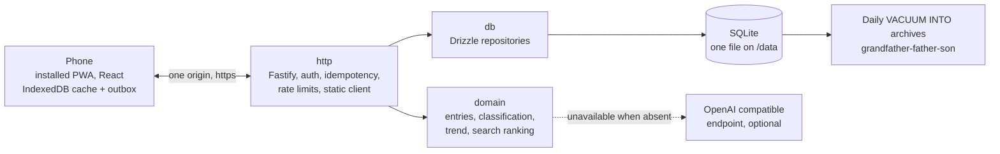

# Portionium

Most people who want to eat better do not need a number for every bite. They need to notice, a
few weeks in, that this week held five fried things and last week held two. Counting calories is
precise enough to be useless: it wants a kitchen scale, a lookup and a minute of attention per
meal, and the first day somebody skips it the whole record is worth nothing. Portionium is a food
and weight diary for a household where logging a meal means tapping the things you ate and
nothing else. It is built for people who have already quit a tracker at least once.

## What you look at



Five dots is the day, one per thing eaten. Green is food you can eat without thinking about it,
yellow is food worth noticing, orange is food worth deciding on. There is no quantity anywhere on
this screen and no number that adds up. The week's row is an allowance rather than a score:
a colour you set no limit for is only counted, and going over one is shown as the size of the
overshoot rather than as a failure.

## The idea

**Lower the resolution instead of stopping.** Every tracker fails the same way: the accuracy it
demands is the reason people stop, and a diary nobody keeps measures nothing. Three colours
survive a canteen, a restaurant and a bad week, because there is nothing to look up and nothing
to weigh. There is no quantity field and there will not be one, which is deliberate and written
down in [ADR 011](./docs/adr/011-an-entry-is-a-colour.md): the moment portions become enterable
this turns back into the calorie counter it exists to replace.

**A daily weight is mostly not weight.** Hydration, salt, gut contents and which floor the scale
is on move the reading by a kilo in somebody whose actual mass has not changed. So the number on
screen is a smoothed trend, the raw reading sits under it in small type, and when there is too
little evidence the trend is not drawn at all rather than guessed
([ADR 008](./docs/adr/008-weight-trend-smoothing.md)).

### Why not an existing tracker

The good ones are calorie counters with a colour theme, and their model of you is a food database
with a login. This one has no ads, no export of your eating to anybody, no account you did not
create on your own server, and it is small enough that one person can read all of it. That is the
whole pitch. If counting calories works for you, keep counting calories.

## What is interesting in the engineering

- **Multi-user isolation is a test suite, not a convention.** Every user owned table carries
  `user_id`, every repository read takes a `userId`, and a row belonging to somebody else answers
  404 rather than 403, so an id is not an oracle. The fixtures create two accounts in two
  timezones for exactly this reason, and the cross account attempts are enumerated in
  [`api/test/http/isolation.test.ts`](./api/test/http/isolation.test.ts)
  ([ADR 003](./docs/adr/003-multi-user-authorization.md)).
- **Every authenticated write is idempotent.** A phone that logs a meal on a dropping connection
  retries from a queue and cannot tell whether the first attempt committed. An `Idempotency-Key`
  replays the stored response instead of writing twice, including for the fingerprint mismatch
  and in flight cases:
  [`api/src/http/plugins/idempotency.ts`](./api/src/http/plugins/idempotency.ts),
  [`api/test/http/idempotency.test.ts`](./api/test/http/idempotency.test.ts)
  ([ADR 004](./docs/adr/004-idempotency-keys.md)).
- **A food has no colour, it has a log of opinions about its colour.** The seed, the classifier
  and the two people disagreeing all append; nothing updates a row and nothing deletes one, and
  one resolution rule decides which verdict wins on read:
  [`api/src/db/classification.ts`](./api/src/db/classification.ts),
  [`api/src/domain/classification.ts`](./api/src/domain/classification.ts)
  ([ADR 007](./docs/adr/007-append-only-classification-log.md)).
- **The AI is a dependency that is allowed to be absent.** No expected failure throws: a missing
  key, a timeout, a refusal, an unparseable answer and a spent budget are all one `unavailable`
  result with a reason, nothing blocks on the model, and an instance with no key is a working
  instance that asks you for the colour instead:
  [`api/src/domain/classification/classifier.ts`](./api/src/domain/classification/classifier.ts)
  ([ADR 012](./docs/adr/012-ai-as-a-degradable-dependency.md)).
- **The restore path runs on every push.** A backup nobody has restored is a hope. The `restore`
  job in [`.github/workflows/ci.yml`](./.github/workflows/ci.yml) seeds a database, backs it up
  through the documented CLI, deletes the file and both its sidecars, restores it through the
  documented CLI and asserts the records came back:
  [`api/test/backup.test.ts`](./api/test/backup.test.ts),
  [`api/src/db/backup.ts`](./api/src/db/backup.ts).
- **Offline writes queue on the device and land once.** One directional, no sync engine, no
  conflict resolution, and a client side twin of the server's day boundary arithmetic so a meal
  logged on a train is filed under the same date on both sides:
  [`web/src/outbox.ts`](./web/src/outbox.ts),
  [`web/src/outbox.test.ts`](./web/src/outbox.test.ts)
  ([ADR 010](./docs/adr/010-pwa-and-offline-outbox.md)).

## How it fits together



One Node process, one SQLite file, one container, one origin. `domain` imports no framework and
no database library, and [`.dependency-cruiser.cjs`](./.dependency-cruiser.cjs) fails CI when that
stops being true. Why SQLite is [ADR 001](./docs/adr/001-sqlite-over-postgresql.md), why there is
no Redis and no metrics stack is [ADR 005](./docs/adr/005-no-redis-no-metrics-stack.md).

## Running it

Docker and the Compose plugin are the only prerequisites. Nothing to edit first, no `.env` to
copy.

```sh
git clone git@github.com:marcogerstmann/portionium.git
cd portionium
docker compose up -d
```

That builds the image, applies the migrations, loads the food catalog and serves on
**http://localhost:8080**.

There is no sign up page, so make the first account. It is an admin, because there is nobody to
have granted it one. The password is asked for at a prompt rather than taken as an argument, so
it stays out of your shell history:

```sh
docker compose exec app node dist/cli/user.js create \
  --email you@example.com --name "Your Name" --timezone Europe/Berlin
```

**To put it on a phone**, the instance needs a domain and https: a browser refuses to register a
service worker on an insecure origin, and without one there is nothing to install. The `caddy`
profile gets a certificate on the first request. Then open the address on the phone and install
it, which is the install icon in Chrome's address bar, or Share and then Add to Home Screen on an
iPhone, and sign in there once. Server, domain, TLS and the checks afterwards are
[docs/runbooks/deploy.md](./docs/runbooks/deploy.md).

Settings are [`.env.example`](./.env.example), every one of them with a default. To change one on
a deployment, put it in a `.env.docker` beside the Compose file and restart.

## Where things are

- [docs/adr/](./docs/adr/) for the decisions and what would change our minds about them
- `GET /api/v1/docs` on a running instance, and the committed contract at
  [`api/openapi/openapi.json`](./api/openapi/openapi.json)
- [docs/runbooks/deploy.md](./docs/runbooks/deploy.md) and
  [docs/runbooks/backup.md](./docs/runbooks/backup.md)
- [SECURITY.md](./SECURITY.md) for reporting a vulnerability, rotating a password, ending every
  session and revoking tokens
- [AGENTS.md](./AGENTS.md) for local setup, layout and the conventions this repository is held to

## Limits, and what this is not

- **No calorie counting, no macros, no portion sizes.** Not missing, refused.
- **No multi-device sync in v1.** The outbox goes one way. Log on two phones at once and the
  server is still correct, but the second device shows what it has until it next reads.
- **No shared weight data.** Accounts on one instance see their own days and their own trend.
  The food catalog is the only thing held in common. There is no household leaderboard and there
  will not be one.
- **No photo classification yet.** Text only. The classifier seam takes a name and gives
  back a colour.
- **One small server.** Rate limit counters live in process memory, so restarting clears them and
  a second instance would not share them. That is fine for a household and wrong for anything
  larger.
- **The shipped catalog is about 240 foods weighted at German everyday eating.** Anything else
  gets classified once, by you or by a model, and is then in the catalog for everybody on the
  instance.
- **Colour is energy density as the food is eaten, not a verdict on whether a food is good.**
  Nuts and olive oil come out orange. That is what the model says and the model is not corrected
  to be polite.
